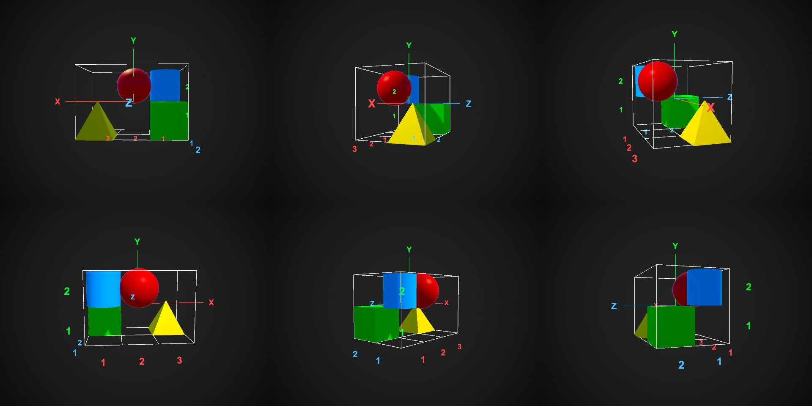

# Integrity Bench

Frontier AI seems broadly overconfident about its own ability. [Integrity Bench](https://integrity-bench.com) shows just by how much: models answer questions across ten domains of scaling difficulty, state their confidence as a percentage alongside every answer, and we score how well that confidence matches how often they are actually right.

This repository is the website plus all of the results it is built from. Per-question results for every model (question ids, difficulty levels, scores, confidences, costs and timings) live in the [data folder](data/) and grow as new runs come in. The question bank itself stays private to keep the benchmark uncontaminated, but the website shows a few examples, like counting the chairs in a rendered scene or reconstructing a 3D scene from several viewpoints:

  
  

